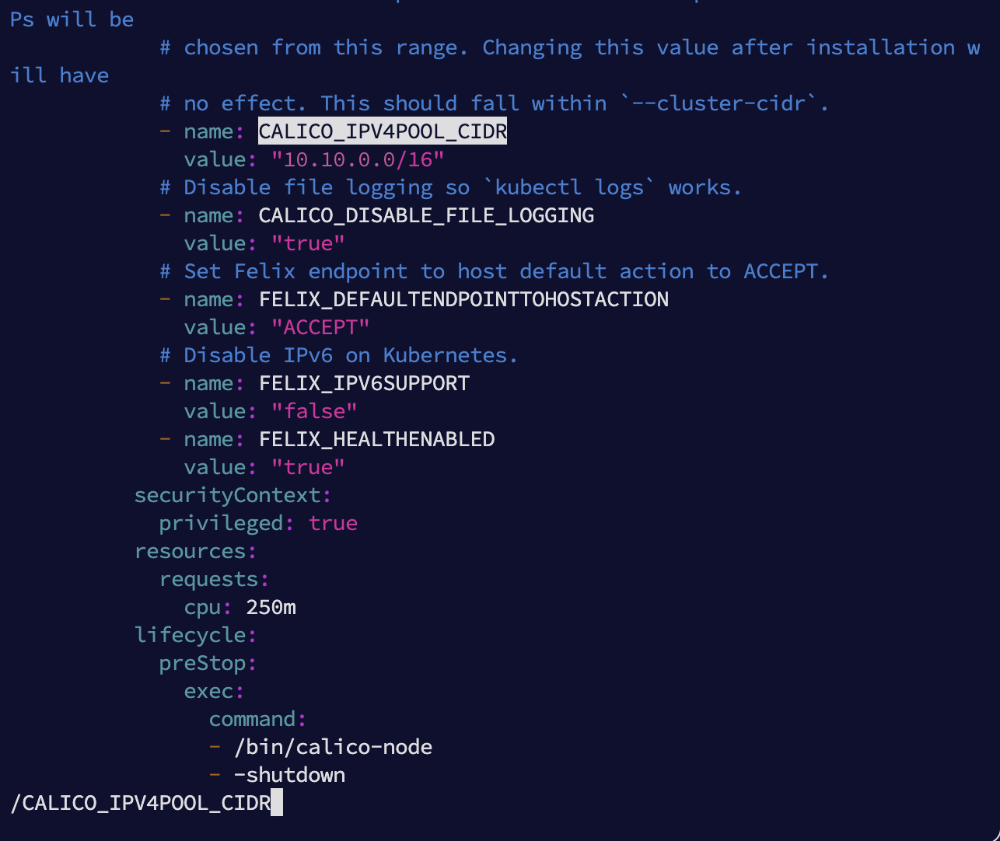
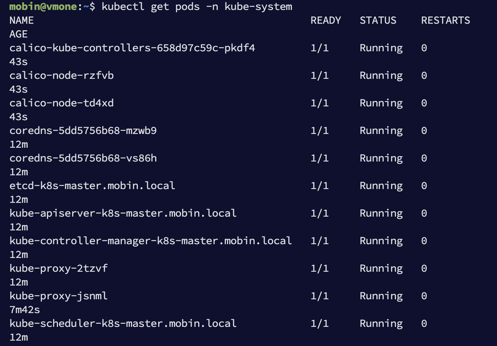
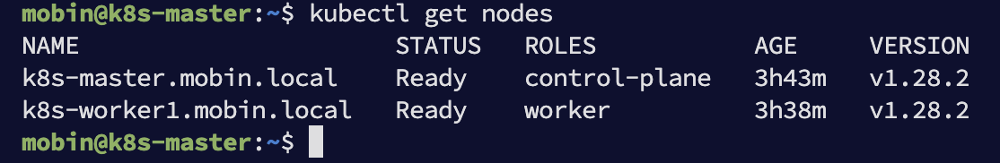

# Kubernetes cluster setup using kubeadm

Here follow the installation process to setup kubernetes cluster using kubeadm.

## Prerequisite:
- Need at least 2 ubuntu server for Master and Worker
- Min size 2vcpus and 4 GB RAM
- Enable 6443 ports in Master node

## Process:

### Apply for Master and Worker

1. Update to the latest version
```bash
sudo apt update && sudo apt upgrade -y
```
2. Restart the servers
```bash
sudo reboot
```

2. Set hostname and update hosts file

#### Master node
```bash
sudo hostnamectl set-hostname "k8s-master.mobin.local"
```
#### Worker node
```bash
sudo hostnamectl set-hostname "k8s-worker1.mobin.local"
```
#### Update the hosts file on all nodes

```bash
sudo vi /etc/hosts
```
#### Add below records on all nodes
```bash
# your_server_ip setup_hostname servername
172.16.0.4 k8s-master.mobin.local vmone
172.16.0.5 k8s-worker1.mobin.local vmtwo
```
3. Disable swap for all nodes
```bash
sudo swapoff -a
```
check the `/etc/fstab` file to find swap. and if anything found there then comment out that
```bash
sudo vi /etc/fstab
```
check the swap status
```bash
sudo mount -a
free -h
```
4. Load kernel modules on all nodes
```bash
sudo tee /etc/modules-load.d/containerd.conf <<EOF
overlay
br_netfilter
EOF
```
```bash
sudo modprobe overlay
sudo modprobe br_netfilter
```
5. Set the following Kernel parameters for Kubernetes.
```bash
sudo tee /etc/sysctl.d/kubernetes.conf <<EOF
net.bridge.bridge-nf-call-ip6tables = 1
net.bridge.bridge-nf-call-iptables = 1
net.ipv4.ip_forward = 1
EOF
```
6. Then reload sysctl
```bash
sudo sysctl --system
```
7. Install containerd run time on all nodes
```bash
sudo apt install -y curl gnupg2 software-properties-common apt-transport-https ca-certificates
sudo curl -fsSL https://download.docker.com/linux/ubuntu/gpg | sudo gpg --dearmour -o /etc/apt/trusted.gpg.d/docker.gpg
sudo add-apt-repository "deb [arch=amd64] https://download.docker.com/linux/ubuntu $(lsb_release -cs) stable"
sudo apt update
sudo apt install -y containerd.io
```
8. After completeting the installation step then add the configuration
```bash
containerd config default | sudo tee /etc/containerd/config.toml >/dev/null 2>&1
sudo sed -i 's/SystemdCgroup \= false/SystemdCgroup \= true/g' /etc/containerd/config.toml
sudo systemctl restart containerd
sudo systemctl enable containerd
```

### Install Kubernetes on Master and Worker nodes
1. Run below commads
```bash
curl -s https://packages.cloud.google.com/apt/doc/apt-key.gpg | sudo apt-key add -
sudo apt-add-repository "deb http://apt.kubernetes.io/ kubernetes-xenial main"
sudo apt update
sudo apt install -y kubelet kubeadm kubectl
sudo apt-mark hold kubelet kubeadm kubectl
```
2. Initialize the cluster using kubeadm
## It's only for Master node
```bash
sudo kubeadm init \
  --pod-network-cidr=10.10.0.0/16 \
  --control-plane-endpoint=k8s-master.mobin.local
```
About the pod network, you can change following your needs: `10.10.0.0/16`

If run successfully, the result will be:
```bash
sudo kubeadm init \
  --pod-network-cidr=10.10.0.0/16 \
  --control-plane-endpoint=k8s-master.mobin.local
I0225 15:24:08.687771    5320 version.go:256] remote version is much newer: v1.29.2; falling back to: stable-1.28
[init] Using Kubernetes version: v1.28.7
[preflight] Running pre-flight checks
[preflight] Pulling images required for setting up a Kubernetes cluster
[preflight] This might take a minute or two, depending on the speed of your internet connection
[preflight] You can also perform this action in beforehand using 'kubeadm config images pull'
W0225 15:24:18.953257    5320 checks.go:835] detected that the sandbox image "registry.k8s.io/pause:3.6" of the container runtime is inconsistent with that used by kubeadm. It is recommended that using "registry.k8s.io/pause:3.9" as the CRI sandbox image.
[certs] Using certificateDir folder "/etc/kubernetes/pki"
[certs] Generating "ca" certificate and key
[certs] Generating "apiserver" certificate and key
[certs] apiserver serving cert is signed for DNS names [k8s-master.mobin.local kubernetes kubernetes.default kubernetes.default.svc kubernetes.default.svc.cluster.local] and IPs [10.96.0.1 172.16.0.4]
[certs] Generating "apiserver-kubelet-client" certificate and key
[certs] Generating "front-proxy-ca" certificate and key
[certs] Generating "front-proxy-client" certificate and key
[certs] Generating "etcd/ca" certificate and key
[certs] Generating "etcd/server" certificate and key
[certs] etcd/server serving cert is signed for DNS names [k8s-master.mobin.local localhost] and IPs [172.16.0.4 127.0.0.1 ::1]
[certs] Generating "etcd/peer" certificate and key
[certs] etcd/peer serving cert is signed for DNS names [k8s-master.mobin.local localhost] and IPs [172.16.0.4 127.0.0.1 ::1]
[certs] Generating "etcd/healthcheck-client" certificate and key
[certs] Generating "apiserver-etcd-client" certificate and key
[certs] Generating "sa" key and public key
[kubeconfig] Using kubeconfig folder "/etc/kubernetes"
[kubeconfig] Writing "admin.conf" kubeconfig file
[kubeconfig] Writing "kubelet.conf" kubeconfig file
[kubeconfig] Writing "controller-manager.conf" kubeconfig file
[kubeconfig] Writing "scheduler.conf" kubeconfig file
[etcd] Creating static Pod manifest for local etcd in "/etc/kubernetes/manifests"
[control-plane] Using manifest folder "/etc/kubernetes/manifests"
[control-plane] Creating static Pod manifest for "kube-apiserver"
[control-plane] Creating static Pod manifest for "kube-controller-manager"
[control-plane] Creating static Pod manifest for "kube-scheduler"
[kubelet-start] Writing kubelet environment file with flags to file "/var/lib/kubelet/kubeadm-flags.env"
[kubelet-start] Writing kubelet configuration to file "/var/lib/kubelet/config.yaml"
[kubelet-start] Starting the kubelet
[wait-control-plane] Waiting for the kubelet to boot up the control plane as static Pods from directory "/etc/kubernetes/manifests". This can take up to 4m0s
[apiclient] All control plane components are healthy after 10.503384 seconds
[upload-config] Storing the configuration used in ConfigMap "kubeadm-config" in the "kube-system" Namespace
[kubelet] Creating a ConfigMap "kubelet-config" in namespace kube-system with the configuration for the kubelets in the cluster
[upload-certs] Skipping phase. Please see --upload-certs
[mark-control-plane] Marking the node k8s-master.mobin.local as control-plane by adding the labels: [node-role.kubernetes.io/control-plane node.kubernetes.io/exclude-from-external-load-balancers]
[mark-control-plane] Marking the node k8s-master.mobin.local as control-plane by adding the taints [node-role.kubernetes.io/control-plane:NoSchedule]
[bootstrap-token] Using token: mo10h3.l9hjrdakikjevv7s
[bootstrap-token] Configuring bootstrap tokens, cluster-info ConfigMap, RBAC Roles
[bootstrap-token] Configured RBAC rules to allow Node Bootstrap tokens to get nodes
[bootstrap-token] Configured RBAC rules to allow Node Bootstrap tokens to post CSRs in order for nodes to get long term certificate credentials
[bootstrap-token] Configured RBAC rules to allow the csrapprover controller automatically approve CSRs from a Node Bootstrap Token
[bootstrap-token] Configured RBAC rules to allow certificate rotation for all node client certificates in the cluster
[bootstrap-token] Creating the "cluster-info" ConfigMap in the "kube-public" namespace
[kubelet-finalize] Updating "/etc/kubernetes/kubelet.conf" to point to a rotatable kubelet client certificate and key
[addons] Applied essential addon: CoreDNS
[addons] Applied essential addon: kube-proxy

Your Kubernetes control-plane has initialized successfully!

To start using your cluster, you need to run the following as a regular user:

  mkdir -p $HOME/.kube
  sudo cp -i /etc/kubernetes/admin.conf $HOME/.kube/config
  sudo chown $(id -u):$(id -g) $HOME/.kube/config

Alternatively, if you are the root user, you can run:

  export KUBECONFIG=/etc/kubernetes/admin.conf

You should now deploy a pod network to the cluster.
Run "kubectl apply -f [podnetwork].yaml" with one of the options listed at:
  https://kubernetes.io/docs/concepts/cluster-administration/addons/

You can now join any number of control-plane nodes by copying certificate authorities
and service account keys on each node and then running the following as root:

  kubeadm join k8s-master.mobin.local:6443 --token mo10h3.l9hjrdakikjevv7s \
        --discovery-token-ca-cert-hash sha256:d51b316269cd51f047957f352a292e3ba08e6cf4b4d3be45ffb997d31c0f90d2 \
        --control-plane 

Then you can join any number of worker nodes by running the following on each as root:

kubeadm join k8s-master.mobin.local:6443 --token mo10h3.l9hjrdakikjevv7s \
        --discovery-token-ca-cert-hash sha256:d51b316269cd51f047957f352a292e3ba08e6cf4b4d3be45ffb997d31c0f90d2
```

3. Execute the below commands on the master node
```bash
mkdir -p $HOME/.kube
sudo cp -i /etc/kubernetes/admin.conf $HOME/.kube/config
sudo chown $(id -u):$(id -g) $HOME/.kube/config
```
4. Check cluster status
```bash
kubectl cluster-info
kubectl get nodes
```
result as below
```bash
mobin@vmone:~$ kubectl cluster-info
Kubernetes control plane is running at https://k8s-master.mobin.local:6443
CoreDNS is running at https://k8s-master.mobin.local:6443/api/v1/namespaces/kube-system/services/kube-dns:dns/proxy

To further debug and diagnose cluster problems, use 'kubectl cluster-info dump'.

mobin@vmone:~$ kubectl get nodes
NAME                     STATUS     ROLES           AGE     VERSION
k8s-master.mobin.local   NotReady   control-plane   2m59s   v1.28.2
```
5. Add worker to the cluster
### Run in Worker nodes only
before running this join command run the below one to check the worker is clean to join
```bash
sudo kubeadm reset pre-flight checks
```
then run the below join command
```bash
sudo kubeadm join k8s-master.mobin.local:6443 --token mo10h3.l9hjrdakikjevv7s \
        --discovery-token-ca-cert-hash sha256:d51b316269cd51f047957f352a292e3ba08e6cf4b4d3be45ffb997d31c0f90d2
```
result as below
```bash
sudo kubeadm join k8s-master.mobin.local:6443 --token mo10h3.l9hjrdakikjevv7s \
        --discovery-token-ca-cert-hash sha256:d51b316269cd51f047957f352a292e3ba08e6cf4b4d3be45ffb997d31c0f90d2
[preflight] Running pre-flight checks
[preflight] Reading configuration from the cluster...
[preflight] FYI: You can look at this config file with 'kubectl -n kube-system get cm kubeadm-config -o yaml'
[kubelet-start] Writing kubelet configuration to file "/var/lib/kubelet/config.yaml"
[kubelet-start] Writing kubelet environment file with flags to file "/var/lib/kubelet/kubeadm-flags.env"
[kubelet-start] Starting the kubelet
[kubelet-start] Waiting for the kubelet to perform the TLS Bootstrap...

This node has joined the cluster:
* Certificate signing request was sent to apiserver and a response was received.
* The Kubelet was informed of the new secure connection details.

Run 'kubectl get nodes' on the control-plane to see this node join the cluster.
```
6. Check cluster nodes on Master
```bash
kubectl get nodes
```
result as below
```bash
kubectl get nodes
NAME                      STATUS     ROLES           AGE     VERSION
k8s-master.mobin.local    NotReady   control-plane   5m21s   v1.28.2
k8s-worker1.mobin.local   NotReady   <none>          14s     v1.28.2
```
it's joined but not ready because of network connectivity. 

### Install Calico Pod Network on Master node only
1. Download the yaml file
```bash
curl https://raw.githubusercontent.com/projectcalico/calico/v3.25.0/manifests/calico.yaml -O
```
2. Open this yaml file
```bash
sudo vi calico.yaml
```
and find `CALICO_IPV4POOL_CIDR`. then uncomment it and place your pod-network-cidr there.

3. Install the Calico yaml on Master node
```bash
kubectl apply -f calico.yaml
```
4. Check kube-system pods
```bash
kubectl get pods -n kube system
```

5. check cluster nodes
```bash
kubectl get nodes
```


6. Let's change the worker node lable
```bash
kubectl label node k8s-worker1.mobin.local node-role.kubernetes.io/worker=worker
```


Now all nodes up and running for deployment

